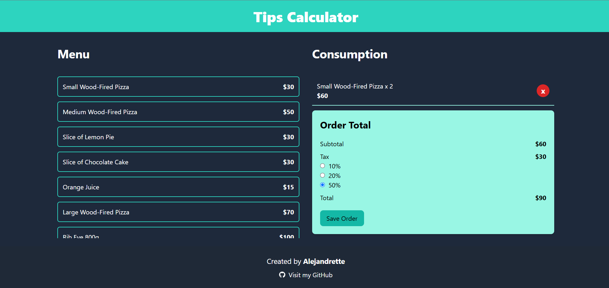
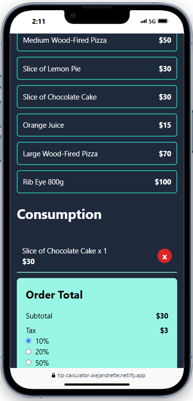

# 💰 Tip Calculator

Bienvenido a **Tip Calculator**, una aplicación que te permite calcular la propina de manera rápida y sencilla. La aplicación es totalmente **responsive** y aprovecha las tecnologías modernas de React para brindar una experiencia fluida y eficiente.

## 🚀 Demo en Vivo

Prueba la aplicación en vivo haciendo clic en el siguiente enlace:

🔗 [Demo en vivo](https://tip-calculator-alejandrette.netlify.app/)

## ⚙️ Tecnologías Utilizadas

- **React ⚛️**: Biblioteca principal para construir la interfaz de usuario.
- **TypeScript 📜**: Para un tipado seguro y mejor mantenimiento del código.
- **Tailwind CSS 🎨**: Para un diseño moderno y responsive.
- **React Hooks 🔄**:
  - `useState`: Para manejar el estado de la propina y el total a pagar.
  - `useMemo`: Para actualizar los valores en tiempo real según los cambios en la selección del usuario.

## 🌍 Características

- **Cálculo de propina en tiempo real** 🧮
  - Ingresa el total de la cuenta y selecciona un porcentaje de propina para ver el resultado instantáneamente.
- **Interfaz intuitiva y minimalista** 🎨
  - Diseño limpio y moderno con botones fáciles de usar.
- **Selección de porcentaje de propina** 🔢
  - Diferentes opciones de propina preestablecidas (10%, 20%, 50%).
- **Responsive Design 📱**
  - Adaptado para funcionar en dispositivos móviles, tabletas y computadoras de escritorio.

## 📦 Instalación y Uso

1. Clona el repositorio:

```bash
  git clone https://github.com/alejandrette/Tip-Calculator.git
```

2. Instala las dependencias:

```bash
  npm install
```

3. Ejecuta la aplicación en modo desarrollo:

```bash
  npm run dev
```

4. Abre `http://localhost:5173` en tu navegador para ver la aplicación en acción.

## 📱 Capturas de Pantalla

Vista en escritorio:


Vista en móvil:


## 🛠 Cómo funciona

1. Ingresa el monto total de la cuenta.
2. Selecciona un porcentaje de propina.
3. El total a pagar se actualizará automáticamente.
4. Puedes cambiar el porcentaje o ingresar otro monto en cualquier momento.

## 🚀 Desarrollo Futuro

- **Opciones personalizadas**: Permitir al usuario ingresar un porcentaje de propina manualmente.
- **Modo oscuro**: Agregar una opción para cambiar entre modo claro y oscuro.
- **Historial de cálculos**: Guardar los últimos cálculos realizados.

## 👥 Contribuciones

Si deseas contribuir al proyecto, sigue estos pasos:

1. Haz un fork del repositorio.
2. Crea una nueva rama (`git checkout -b feature/nueva-funcionalidad`).
3. Realiza tus cambios y haz commit (`git commit -m 'Añadir nueva funcionalidad'`).
4. Haz push a tu rama (`git push origin feature/nueva-funcionalidad`).
5. Abre un Pull Request.

¡Gracias por visitar el proyecto! Si tienes alguna duda o sugerencia, no dudes en abrir un issue. 💬
